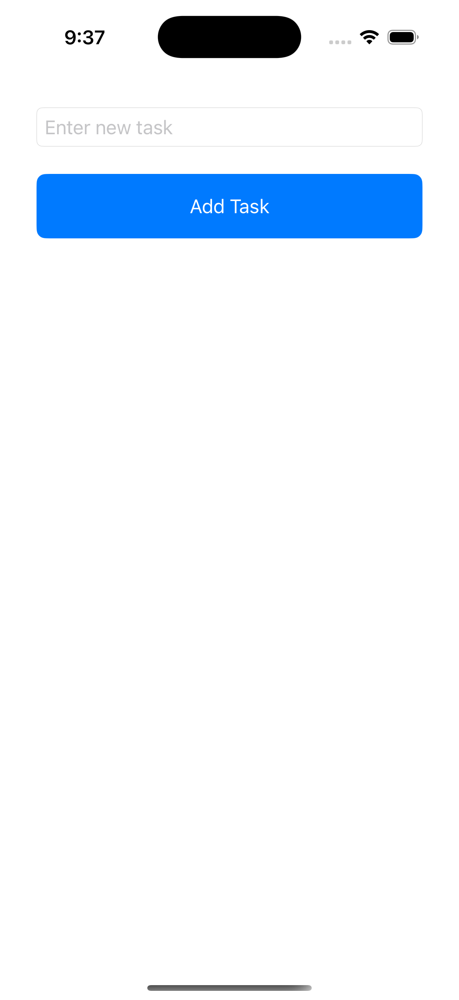
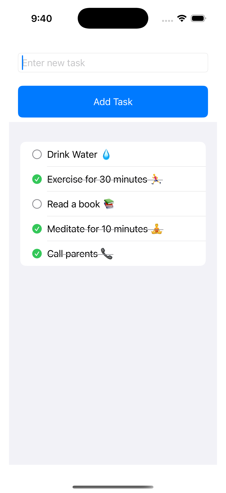
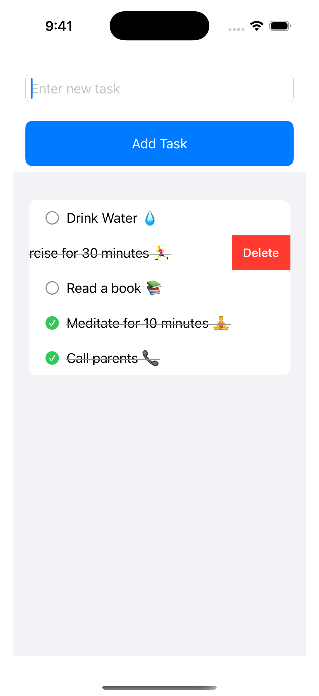

# 📝 ToDo List App (iOS)

A simple and intuitive ToDo List app built using **Swift** and **SwiftUI** for iOS devices.  
This project is my first step into iOS development and showcases my understanding of Swift basics, UI design, and data handling.

---

## 🚀 Features
- Add new tasks to your ToDo list
- Mark tasks as complete
- Delete tasks
- Clean and minimal UI with SwiftUI
- Works smoothly on iPhone

---

## 🛠️ Tech Stack
- **Language:** Swift
- **Framework:** SwiftUI
- **Platform:** iOS
- **IDE:** Xcode

---

## 📸 Screenshots

### Main screen


### Add Task


### Completed Task


### Delete task

---

## 🎯 Learning Outcomes
- Learned basics of Swift syntax
- Created UI using SwiftUI
- Implemented state management for task handling
- Understood iOS app project structure in Xcode

---

## 🏃 How to Run
1. Clone this repository:
   ```bash
   git clone https://github.com/sameer-saifi1b/SwiftUI-ToDoListApp.git
   
Open ToDoListApp.xcodeproj in Xcode

Select an iOS Simulator (e.g., iPhone 15)

Press Run ▶️

📬 Contact

Sameer Saifi

📧 Email: sameer.saifi1b@gmail.com

💼 www.linkedin.com/in/sameer-saifi1b

🐙 https://github.com/sameer-saifi1b

